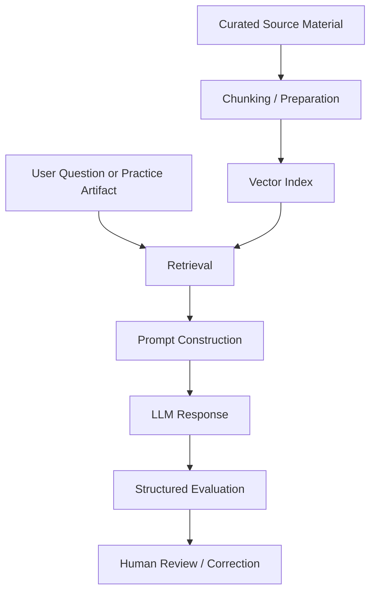

# Architecture

A retrieval-grounded, multimodal teaching pipeline. Curated instructional
material is prepared and indexed; user questions (and short practice artifacts)
are answered by retrieving grounded context, constructing a prompt, and
generating a response that is then available for structured evaluation and
human review.

## Components

- **API / backend** — FastAPI app (`teaching-engine/app`) exposing a knowledge
  Q&A endpoint (`/chat`) and a stateful lesson endpoint (`/lesson`), both
  streaming-capable.
- **Retrieval / indexing** — a tiered-budget retriever over a ChromaDB vector
  store (`teaching-engine/services/rag`), with sentence-transformer embeddings.
  Era filtering is applied at query time. *The index built from the private
  development corpus is not included in this repository.*
- **Source preparation** — ingestion utilities for text, PDFs, and media; in the
  public repo these run against synthetic/rights-cleared `sample_data/` only.
- **Prompt construction** — per-era system prompts assembled at request time
  (`teaching-engine/teachers/jerome-callet/prompts`), with retrieved context
  injected as grounded, cited source blocks.
- **Audio / transcription workflow** — librosa-based analyzers (spit-buzz
  scorer, double-pedal detector, played-passage tone analyzer + clean-range
  gate) and a Whisper-based transcription path for instructional media.
- **Evaluation workflow** — an LLM-as-judge harness scoring responses on
  factual grounding, domain alignment, completeness, and helpfulness.
- **Human review loop** — lesson feedback is structured so a qualified reviewer
  can correct or approve AI-generated guidance before it is relied on.
